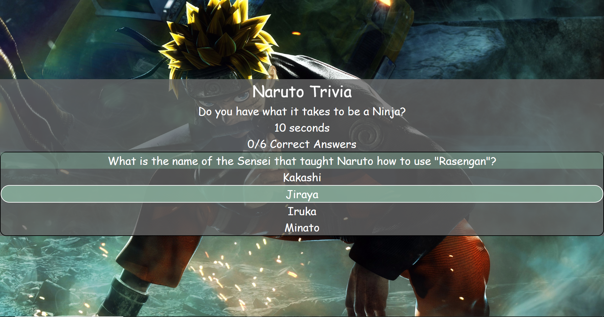
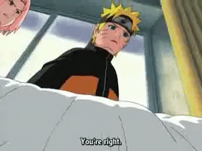

# Trivia-Game
### Links: 
https://bryanjacinto1994.github.io/Trivia-Game/
<br>
https://github.com/bryanjacinto1994/Trivia-Game


## Images




<hr>

## Tools Used:

* Visual Studio Code - Open source code editor for building and debugging web and cloud applications.
* JavaScript - A scripting language that uses curly-bracket syntax, first class functions and object-oriented.
* jQuery - A JavaScript library that simplifys to manipulate HTML DOM.
* HTML - Used to create elements on the DOM.
* CSS - Styles the html elements on page. 
* Git - Version control system to track changes to source code.
* Github - Hosts respository that can be deployed to GitHub pages.


<hr>

## Summary

Using HTML, CSS, JavaScript, and jQuery library for JS via Visual Studio Code, a game is created to make a trivia game with timer countdowns.

The goal of this game is to choose the correct answer. If the answer is correct, the user will get a notice saying that the answer is correct and it moves on to the next question. If the answer is wrong, it will show that the user is wrong and it will move on to the next question as well.

The most interesting part of this assignment is to have the timer set to 15 seconds countdown and once it runs out, it will move to the next question. What is used for the count down is by making functions for a time converter. Once the time converter is set to seconds, "clearInterval", "setInterval", and "setTimeout" is used so the time can be cleared, and then resets again. The time functions is also used on how many seconds it will take to get to the next question.

<hr>

## Code Snippet

index.html :
```html
<body>
    <div class="main-container">
        <div class="container">
            <div class="row">
                <div class="col-md-12" id="title">
                    Naruto Trivia
                </div>
            </div>
        </div>

        <div class="sub-container">
            <div class="row">
                <div class="col-md-12">
                    Do you have what it takes to be a Ninja?
                </div>
            </div>

            <div class="row">
                <div class="col-md-12">
                    <div id="time">15 Seconds</div>
                    <div id="correctNum">Greetings Shinobi! You have 15 seconds to answer every question!</div>
                    <div id="results">
                        <div id="startGameButton">Click to Start!</div>
                    </div>
                </div>
            </div>
        </div>
    </div>

</body>
 
```
JavaScript: 

``` javascript 
function timeConverter(t) {
        var minutes = Math.floor(t / 60);
        var seconds = t - (minutes * 60);
        if (seconds < 10) {
            seconds = "0" + seconds;
        }
        return seconds;
    };

    function timeStart() {
        time = 15;
        clearInterval(intervalId);
        intervalId = setInterval(timesUp, 1000);
    }

    function timesUp() {
        time -= 1;
        var translateTime = timeConverter(time);
        $("#time").html(translateTime + " seconds");
        if (time === 0) {
            $("#results").html("Times up! You are too slow to be a Ninja!")
            quizNum += 1;
            clearInterval(intervalId);
            setTimeout(showNextQuestion, 1500);
            setTimeout(timeStart, 1500);
        }
    }

    function displayQuiz(display) {
        $("#results").html(display.question + display.choice1 + display.choice2 + display.choice3 + display.choice4);
        $("#correctNum").html(correctAnswers + '/6 Correct Answers')
    }

    function showNextQuestion() {

        if (quizNum === (triviaQuestions.length - 1)) {
            clearInterval(intervalId);
            displayQuiz(triviaQuestions[quizNum]);
            showCorrectAnswer();
            showWrongAnswer();
            resetGame();
        }
        else {
            timeStart();
            displayQuiz(triviaQuestions[quizNum]);
            showCorrectAnswer();
            showWrongAnswer();
            resetGame();
        }
    }

    function showCorrectAnswer() {
        $("#answer").on("click", function () {
            $("#results").html('You are a Ninja! <br> ')
            correctAnswers += 1;
            clearInterval(intervalId);
            setTimeout(showNextQuestion, 1500);
        });
    }

    function showWrongAnswer() {
        $(".option").on("click", function () {
            $("#results").html('Incorrect! you are not worth to be a Ninja! <br> ')
            clearInterval(intervalId);
            setTimeout(showNextQuestion, 1500);
        })
    }

    //This starts the game once button is clicked.
    $("#startGameButton").on("click", function () {
        displayQuiz(triviaQuestions[quizNum]);
        timeStart();
        showCorrectAnswer();
        showWrongAnswer();
        resetGame();
    })

    function resetGame() {
        $("#restart").on("click", function () {
            correctAnswers = 0;
            wrongAnswers = 0;
            quizNum = 0;
            displayQuiz(triviaQuestions[quizNum]);
            clearInterval(intervalId);
            timeStart();
            showCorrectAnswer();
            showWrongAnswer();
            resetGame();
        })
    }


})


```

CSS:

``` css

body{
    background-image: url("../images/background.jpg");
    position: fixed;
    font-family: 'Chilanka', cursive;
    background-size: cover;
    width: 100%;
    height: 100%
}

.container{
    text-align: center;
    color: white;
    font-family: 'Chilanka', cursive;
}

.sub-container{
    text-align: center;
    color: white;
    font-family: 'Chilanka', cursive;
    font-size: 35px;
}

.main-container{
    position: relative;
    top: 25%;
    font-family: 'Chilanka', cursive;
    background: rgba(100,100,100,0.8);
}

#title{
    font-size: 50px;
}

#question{
    background: rgba(120, 160,140,0.5);
}

#results{
    border: 2px solid black;
    border-radius: 20px;
}

#answer:hover,
.option:hover{
    border: 2px solid white;
    background: rgba(140, 180,160,0.8);
    border-radius: 40px;
}
```


## Author Links
Linkedin: https://www.linkedin.com/in/bryan-jacinto-100438aa/

Github:
https://github.com/bryanjacinto1994
